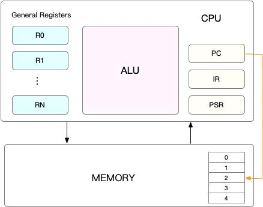

# CPU Context

## CPU上下文切换

* CPU 上下文
```md
CPU 寄存器，是 CPU 内置的容量小、但速度极快的内存。
而程序计数器，则是用来存储 CPU 正在执行的指令位置、或者即将执行的下一条指令位置。
它们都是 CPU 在运行任何任务前，必须的依赖环境，因此也被叫做 CPU 上下文。
```
* 进程上下文切换
```md
进程上下文切换，是指从一个进程切换到另一个进程运行。
只有在进程调度的时候，才需要切换上下文。
```
```md
进程的上下文切换就比系统调用时多了一步：
在保存当前进程的内核状态和 CPU 寄存器之前，需要先把该进程的虚拟内存、栈等保存下来；
而加载了下一进程的内核态后，还需要刷新进程的虚拟内存和用户栈。
```

* 线程上下文切换
```md
内核中的任务调度，实际上的调度对象是线程；而进程只是给线程提供了虚拟内存、全局变量等资源。
```
```md
当进程只有一个线程时，可以认为进程就等于线程。
当进程拥有多个线程时，这些线程会共享相同的虚拟内存和全局变量等资源。这些资源在上下文切换时是不需要修改的。
线程也有自己的私有数据，比如栈和寄存器等，这些在上下文切换时也是需要保存的。
```
```md
两种情况:
1. 前后两个线程属于不同进程。此时，因为资源不共享，所以切换过程就跟进程上下文切换是一样。
2. 前后两个线程属于同一个进程。此时，因为虚拟内存是共享的，
    所以在切换时，虚拟内存这些资源就保持不动，只需要切换线程的私有数据、寄存器等不共享的数据。
```
* 中断上下文切换
```md
对同一个 CPU 来说，中断处理比进程拥有更高的优先级。所以中断上下文切换并不会与进程上下文切换同时发生。
同样道理，由于中断会打断正常进程的调度和执行，所以大部分中断处理程序都短小精悍，以便尽可能快的执行结束。
```
```md
中断上下文切换也需要消耗 CPU，切换次数过多也会耗费大量的 CPU，甚至严重降低系统的整体性能。
所以，当你发现中断次数过多时，就需要注意去排查它是否会给你的系统带来严重的性能问题。
```

